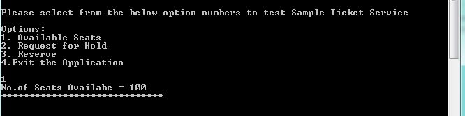
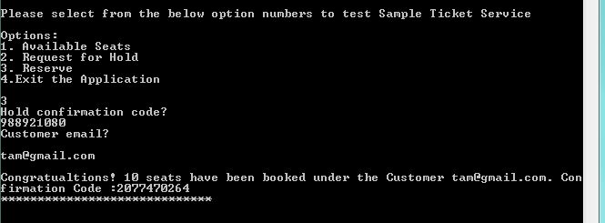

                                    Ticket Service Coding Challenge

A simple ticket service that facilitates the discovery, temporary hold and final reservation of seats within a high-demand performance venue.
Assumptions:
1)	The highest priority available seat is the seat farthest from the screen and the left most one, and least prior one will be the row nearest to the screen and the right most.
2)	Number of Rows and Number of seat per row are defaulted to 10, and  hold expiration is set to 120 seconds and these are available to change if required in an external property file TicketServiceConfiguration.properties.
3)	Logging has been enabled and the file is available at logs/TicketServiceLogger.
4)	Seat number will be the rownumber:SeatPostiionNumber in the row.
5)	There is no restriction on how many times or how many tickets a customer can book.
Building and Testing the Code: 
1)	Clone the project from Git to the local computer.
2)	Make sure JAVA is installed and JAVA_HOME and MAVEN_HOME are set up in the path variables.
3)	Once you are in the SampleTicketService folder start running the below commands in the command prompt.

      mvn clean install

      cd target

      java -jar SampleTicketService-jar-with-dependencies.jar RunTicketService.java

4)	Once you run the above commands the project should be build and target folder will be created and program will start running asking for the options to enter you can test all three scenarios from the command prompt, reference screens attached.
Program starts with below lines

 

5) Here you can start testing the program, once you hit 1, it will print below lines

 

6) Now you can test option 2 by typing 2, then it will promt for inputs once you enter those inputs output will be like below

 

7) And we can test option 3 by typing 3 and see the below screen for reference

 

Sequence Diagrams:
1)	Sequence diagram for Option 1. Available Seats

 

2)	Sequence Diagram for Option 2.Request for Hold

 

3)	Sequence Diagram for Option 3. Reserve

 
Others:
1)	Jacoco plugin is integrated to check code coverage report and it is available at /target/site/jacoco/index.html
2)	Junit test case has been added

